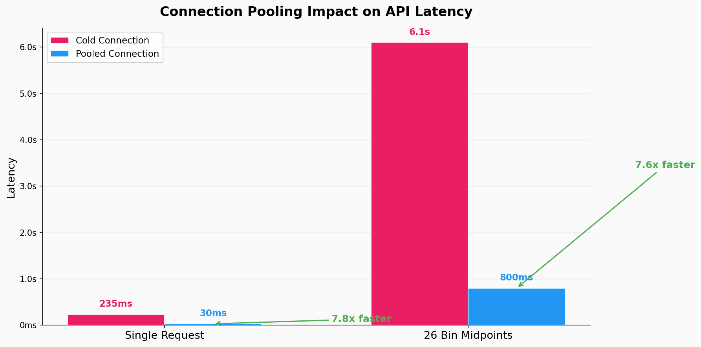
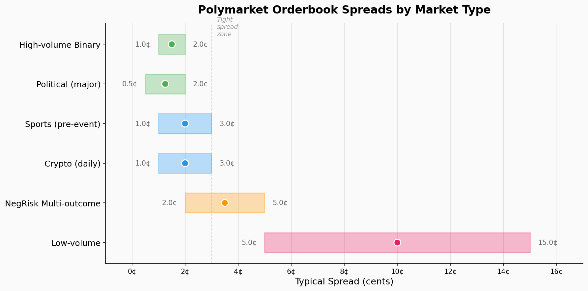

# polymarket-sdk

Python SDK for Polymarket's CLOB (Central Limit Order Book) API. Handles authentication, order management, position tracking, market data, and real-time WebSocket price feeds — everything needed to go from "I have a signal" to "I have a position" programmatically.

## Why This SDK

Polymarket's official `py-clob-client` handles basic API calls but doesn't solve the operational problems of running a live trading system: connection drops during critical moments, HMAC authentication edge cases with connection pooling, batch order atomicity, or the need to correlate L2 orderbook state with fill execution. This SDK wraps those operational concerns into a single interface built from experience running automated strategies against the CLOB.

## Features

- **REST API Client** — Market data, order placement (single + batch up to 15), position queries
- **WebSocket Feed** — Real-time L2 orderbook with thread-safe price access
- **HTTP Connection Pooling** — Pre-warmed connections with HMAC-safe patching (150-300ms latency reduction)
- **Position Manager** — Track open positions, P&L, exposure limits
- **Market Discovery** — Auto-discover active markets by category (crypto, politics, sports)
- **Token Redemption** — Redeem winning positions (CTF + NegRisk contracts)

## Quick Start

```python
from polymarket_sdk import PolymarketClient

# Read-only (no wallet needed)
client = PolymarketClient(mode='paper')
prices = client.get_market_prices("market-slug")
orderbook = client.get_orderbook(token_id)
midpoint = client.get_midpoint(token_id)

# Trading (requires Polygon wallet)
client = PolymarketClient(
    private_key="0x...",
    mode='live'
)

# Place a limit order
client.place_order(
    token_id="0x...",
    side="BUY",
    size=10.0,       # USDC amount
    price=0.55,      # Price per share
    order_type="GTC"
)

# Batch orders (up to 15 per call)
client.place_orders_true_batch(orders, order_type='GTC')

# Position management
positions = client.get_positions_from_data_api()
balance = client.get_balances()
```

## WebSocket Feed

```python
from polymarket_sdk.websocket_feed import WebSocketPriceFeed

feed = WebSocketPriceFeed()
feed.start(up_token_id="0x...", down_token_id="0x...")

prices = feed.get_prices()  # (up_price, down_price)
spread = feed.get_spread()
depth = feed.get_orderbook_depth()
```

## API Architecture

Polymarket exposes three distinct API tiers, each serving different purposes:

```
    ┌─────────────────────────────────────────────────────┐
    │                    Your Strategy                     │
    └──────────┬──────────┬──────────┬────────────────────┘
               │          │          │
    ┌──────────▼────┐ ┌───▼────────┐ ┌▼───────────────────┐
    │  Gamma API    │ │  CLOB API  │ │  Data API          │
    │               │ │            │ │                     │
    │  • Markets    │ │  • Orders  │ │  • Positions        │
    │  • Events     │ │  • Book   │ │  • Balances         │
    │  • Metadata   │ │  • Trades │ │  • Trade history    │
    │               │ │  • Auth   │ │                     │
    │  No auth      │ │  HMAC-256 │ │  HMAC-256           │
    └───────────────┘ └──────────┘ └─────────────────────┘
                          │
               ┌──────────▼──────────┐
               │  WebSocket Feed     │
               │  • L2 book updates  │
               │  • Price changes    │
               │  No auth required   │
               └─────────────────────┘
```

See [docs/API_ARCHITECTURE.md](docs/API_ARCHITECTURE.md) for the full breakdown of each tier, including WebSocket subscription format, HMAC signing flow, and the difference between NegRisk and standard CTF contracts.

### Connection Pooling

HTTP connection pooling eliminates the TCP/TLS handshake overhead on every request, which is critical when querying multiple token midpoints in a loop. The SDK pre-warms a `urllib3` connection pool with HMAC-safe patching.



## Orderbook Analysis

Spreads vary significantly by market type and volume. High-volume binary markets (e.g., "Will BTC hit $X?") typically have the tightest spreads, while low-volume and multi-outcome NegRisk markets show wider ranges.



See [docs/ORDERBOOK_ANALYSIS.md](docs/ORDERBOOK_ANALYSIS.md) for detailed spread analysis methodology and depth interpretation techniques.

## API Endpoints

| Endpoint | Purpose |
|----------|---------|
| `gamma-api.polymarket.com` | Market metadata, events, search |
| `clob.polymarket.com` | Orders, orderbook, midpoints |
| `data-api.polymarket.com` | Positions, balances, trade history |
| `ws-subscriptions-clob.polymarket.com` | WebSocket L2 feed |

## Documentation

| Document | Description |
|----------|-------------|
| [docs/API_ARCHITECTURE.md](docs/API_ARCHITECTURE.md) | 3-tier API architecture, WebSocket protocol, HMAC authentication, NegRisk vs CTF |
| [docs/ORDERBOOK_ANALYSIS.md](docs/ORDERBOOK_ANALYSIS.md) | How to read Polymarket orderbooks, spread patterns, depth analysis techniques |

## Examples

| Example | Description |
|---------|-------------|
| [examples/orderbook_snapshot.py](examples/orderbook_snapshot.py) | Capture and analyze L2 orderbook data in real-time |
| [examples/market_scanner.py](examples/market_scanner.py) | Discover and evaluate active markets programmatically |

## Configuration

Copy `.env.example` to `.env`:
```
POLYGON_PRIVATE_KEY=0x...
POLYGON_RPC=https://polygon-rpc.com
```

## Tech Stack

- `py-clob-client` — Polymarket's official CLOB client
- `eth-account` — Wallet signing (Polygon)
- `websockets` — Real-time orderbook feed
- `requests` + `urllib3` — Connection pooling

## Installation

```bash
pip install -r requirements.txt
```

## Related Projects

- [polymarket-research](https://github.com/pascal-labs/polymarket-research) — Microstructure research using data collected through this SDK
- [pulsefeed](https://github.com/pascal-labs/pulsefeed) — Multi-exchange price feeds that complement Polymarket market data
- [event-probability-models](https://github.com/pascal-labs/event-probability-models) — Models that generate signals executed through this SDK

## License

MIT
